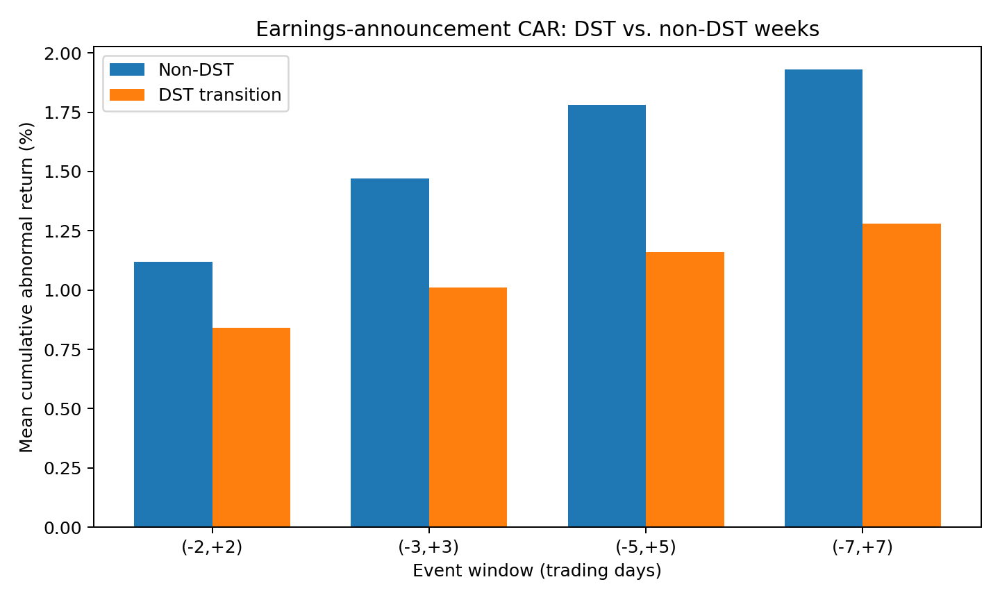
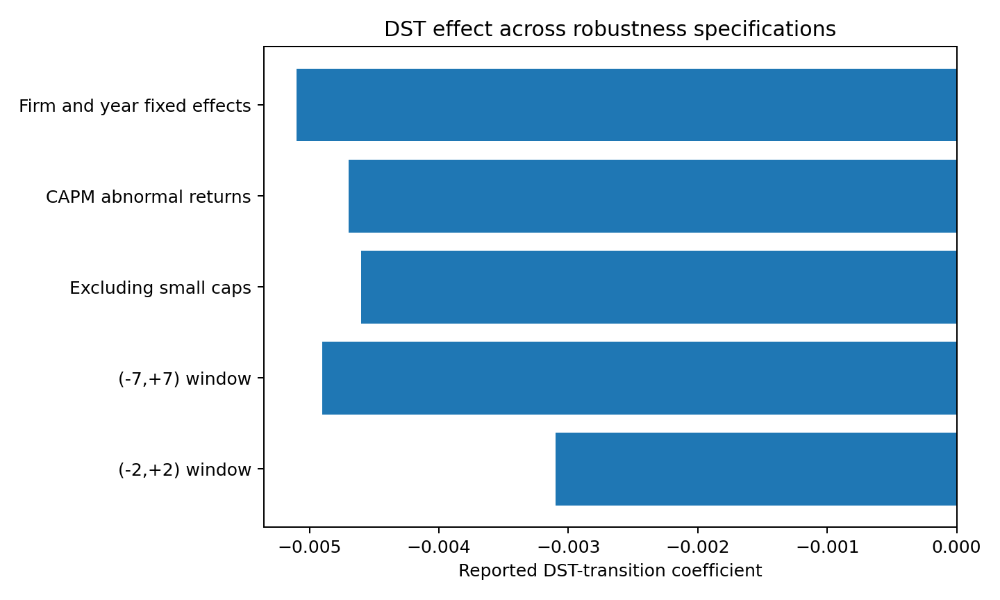

# DST, Investor Attention, and Earnings-Announcement Reactions

This repository accompanies my research paper **“Losing Sleep, Losing Signal: Daylight Saving Time and Investor Attention Around Earnings Announcements.”** The study asks whether the one-hour clock change associated with Daylight Saving Time is linked to weaker market reactions around corporate earnings announcements.

> **Research status:** SSRN (2025)

[Read the full paper](paper/DST_Investor_Attention_Paper.pdf)

## Research question

Does a predictable, non-fundamental attention shock — the DST transition — affect how quickly markets incorporate earnings information into prices?

The paper studies U.S. earnings announcements from **2005–2024**, matching Compustat announcement dates with CRSP daily returns and factor data. The primary outcomes are factor-adjusted abnormal returns (AR) and cumulative abnormal returns (CAR) around earnings announcements.

## Empirical framework

The research design follows this pipeline:

1. Identify earnings announcements occurring in the first trading week after a DST transition.
2. Estimate expected returns using a pre-event Fama–French factor model.
3. Compute daily abnormal returns as realized minus model-implied excess returns.
4. Sum abnormal returns across event windows to obtain CAR.
5. Compare CAR in DST-transition weeks with non-DST weeks.
6. Test robustness across alternative event windows, return models, samples, and fixed-effect specifications.

The paper's main cross-sectional specification controls for firm size, book-to-market, analyst coverage, and industry effects, with two-way clustered inference by firm and year.

## Reported results

The paper reports consistently weaker announcement-period CAR following DST transitions:

| Event window | Non-DST CAR | DST-transition CAR | Difference |
|---|---:|---:|---:|
| (-2,+2) | 1.12% | 0.84% | -0.28% |
| (-3,+3) | 1.47% | 1.01% | -0.46% |
| (-5,+5) | 1.78% | 1.16% | -0.62% |
| (-7,+7) | 1.93% | 1.28% | -0.65% |



The reported cross-sectional regression estimates a **-0.0048** coefficient on the DST-transition indicator (t = -3.01) after controls and industry fixed effects.



## Repository contents

- `paper/` — full research paper.
- `src/factor_model.py` — reusable expected-return and abnormal-return functions.
- `src/event_study.py` — event-window and CAR utilities.
- `src/regressions.py` — illustrative regression helpers for event-level analysis.
- `src/make_figures.py` — recreates the summary figures from the paper's reported tables.
- `results/` — paper-reported headline and robustness results in CSV form.
- `figures/` — recruiter-friendly visual summaries of the reported findings.

## Reproducibility note

The raw CRSP, Compustat, WRDS, and other licensed datasets used in the research are **not redistributed in this repository**. The code therefore provides a transparent implementation template for the empirical methodology, while the included CSV files and figures reproduce **reported summary results from the paper** rather than claiming to regenerate the proprietary raw-data analysis from public files.

## Research and implementation note

I developed the research question, empirical design, model-selection reasoning, interpretation, and manuscript. **AI-assisted programming tools were used to help translate the methodology into code and support implementation/debugging while I developed my programming proficiency.**

The repository is intended to make the quantitative reasoning and workflow behind the research easier to inspect and discuss.

## Run locally

```bash
pip install -r requirements.txt
python src/make_figures.py
```

The core functions in `src/` can also be imported into a notebook or analysis pipeline once appropriately licensed event-level return and factor data are supplied.
